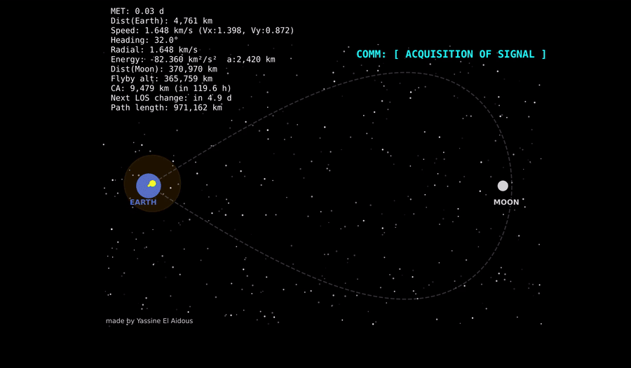
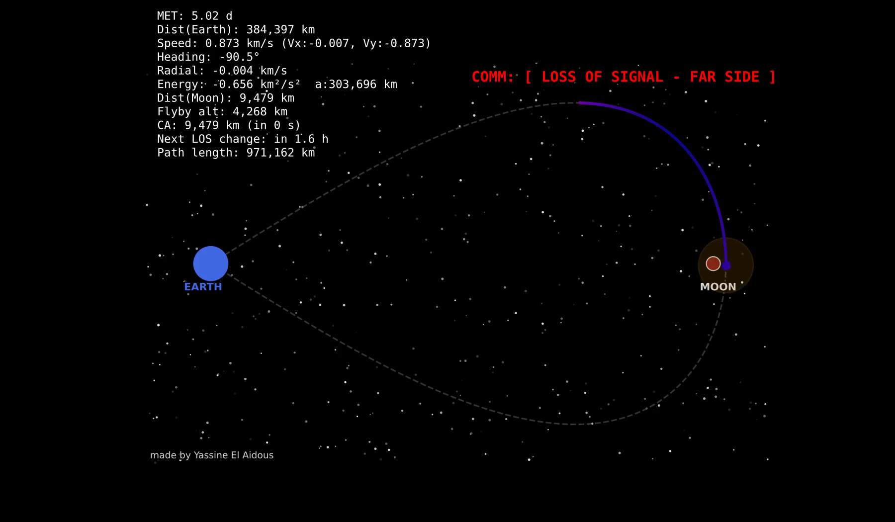

# arthemis

A two-dimensional simulator of an Artemis-style free-return flyby: the
spacecraft leaves Earth, loops behind the Moon and comes back without an
insertion burn. What it is really about is the line of sight, since the
interesting part of a flyby is the stretch where the Moon sits between the
spacecraft and the only antenna that can hear it.



Earth on the left, the Moon on the right, the dashed line the planned path, the
trail coloured by speed and the cyan line the Earth-to-spacecraft link.

## The moment the link goes



At mission elapsed time 5.02 days the spacecraft is 9,479 km from the lunar
centre and the Moon is directly between it and Earth. `check_los()` decides
that with point-to-line geometry rather than by eye: the perpendicular distance
from the lunar centre to the Earth-spacecraft line, against the lunar radius.
The telemetry says when the link comes back, and on the default geometry the
blackout is short, which is the honest answer for this trajectory.

## Running it

```bash
pip install -r requirements.txt

python -m arthemis.main                        # animated, in a window
python -m arthemis.main --headless             # no GUI
python -m arthemis.render_snapshot             # one frame to snapshot.png
python -m arthemis.export_animation --out animation.mp4 --frames 300 --fps 25
```

The mission is parameterised rather than hard-coded, so the geometry can be
moved and the occultation re-checked:

```
--moon-x, --moon-y     where the Moon is (km)
--mission-days         how long the transit lasts
--flyby-altitude       how far past the lunar centre the ship passes
--frames               animation length
```

`export_animation` prefers system `ffmpeg` and falls back to a Pillow GIF.

## Real data, not just the model

- `arow_gcs_fetch.py` pulls the latest AROW telemetry from the public
  `p-2-cen1` Google Cloud Storage bucket and parses it.
- `live_simulator.py` queries JPL Horizons for real state vectors
  (`EPHEM_TYPE=VECTORS`, `CENTER=500`) and puts them behind a Streamlit page,
  so the modelled path can be held against an actual ephemeris.

## Tests

`tests/test_main.py` covers the part worth testing, which is the occultation
predicate: a spacecraft at the origin, one directly behind the Moon, and one
off-axis that should stay visible.

```bash
pytest
```
